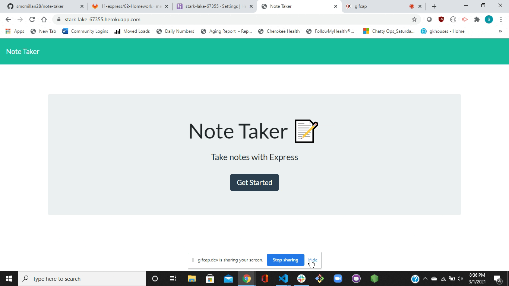

# Note Taker

## Description of Project
How often do you find yourself in need of a pen and paper to jot down a quick note?  While that is a dying medium, mobile phones are not.  With this application, you will be able to quickly save notes and note details to a server hosted by Heroku.  

Simply type in the Note Title and any related details, and you will be given the option to save that note.  Once you press the save button, it will populate on the left hand side of the screen.  Need to revisit that note?  Just click on it!  Once you are done with the note, press the trash can button to delete it from the database. 

Read below for further details.  Enjoy!

## Table of Contents

- [Usage](#usage)
- [Credits and Code Used](#credits-and-code-used)
- [Application Demo](#application-demo)
- [Questions](#questions)
- [Takeaways](#takeaways)

## Usage
This application is deployed through heroku.  Check it out [here!](https://stark-lake-67355.herokuapp.com/)

## Credits and Code Used

- JavaScript/ES6
- HTML/CSS
- Node.js / Node FS library
- npm express and uniqid packages

## Application Demo

## Questions
Check out my GitHub profile [here.](https://github.com/smcmillan28)

Feel free to send me an email, as well: smcmillan1991@gmail.com

## Takeaways
This was the first project in which we created back-end JavaScript and tied that to front-end JavaScript/HTML through Express routing and multiple API requests.  Primary takeaways from this project are:

- Using Express framework for server development (using GET, POST, DELETE methods)
- Creating local database, writing to and reading from that file in response to user requests
- Getting more comfortable with simple API development by using JSON
- Hosting application on Heroku